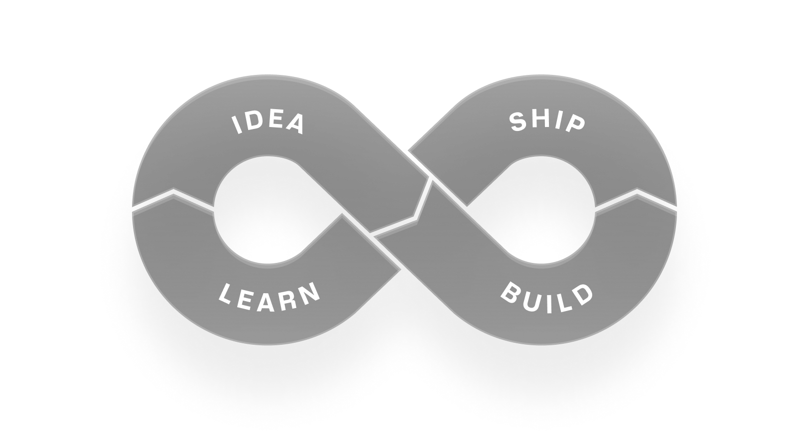

# Intro to DevOps

A combination of the words "development" and "operations", DevOps is a philosophy and set of practices that brings teams together to deliver better software, faster.

## 🔁 Lifecycle

DevOps encompasses every part of application development. Whether you call them "steps", "stages", or "phases", it all adds up to the DevOps lifecycle, the process DevOps teams use to build and ship software. Like any good DevOps approach, teams stay in constant collaboration and share many of the same tools and responsibilities from beginning to end.

### 💡 Idea
Teams gather requirements and feedback, and start sketching out the resources they’ll need. DevOps teams focus on continuous planning—plans that can be updated frequently, even daily. To build out roadmaps and track progress towards their goals, teams leverage project management tools everyone can access and use.

**Core GitHub Features:** Issues, Projects, Discussions

### ⚙️ Build
As project managers assign tasks, developers get to work. Here, DevOps comes to life: With version control and cloud-based development environments, developers can make ongoing changes and review code together in real time. DevOps continuous integration (CI) also kicks in, where automated tools turn code code changes into builds, run tests against required checks, then merge and prepare code for deployment.

**Core GitHub Features:** Web Editor, Codespaces, Actions, Advanced Security

### 🚢 Ship
After passing initial checks, developers use continuous delivery (CD) tools to automatically push code changes to a non-production testing or staging environment. Operations teams can immediately deploy the changes to production, without any surprises.

**Core GitHub Features:** Actions

### 📚 Learn
Software may be out in the world, but the work isn’t over. Operations teams keep an eye on releases with monitoring tools that measure performance and monitor the impact of code changes. They ensure stability and uptime, gather customer feedback and stay in close contact with developers to push required fixes and address incidents faster.

## 🤝 Culture

More than just a lifecycle, DevOps represents a cultural change whereby teams own features from idea all the way to operating in production. They trust each other to work together towards a common goal of delivering working, valuable software to users.

Much has been written about DevOps culture, but there are a few people and frameworks to take particular notice of.

### ☮️ CALMS
John Willis and Jez Humble coined the acronym CALMS, which stands for Culture, Automation, Measurement, Lean, and Sharing

[You can read more about CALMS here](https://itrevolution.com/devops-culture-part-1/).

### 3️⃣ The Three Ways
Gene Kim has two sets of principles well worth investigating.

The [Three Ways of DevOps](https://itrevolution.com/the-three-ways-principles-underpinning-devops/) represent principles that all DevOps patterns can be derived from.

The first way is systems thinking - considering everything from idea through to running in production.

The second way is amplifying feedback loops with a goal of allowing remediation and improvement to be more efficient.

The third way is a culture of continual experimentation, allowing the team to discover what does and doesn't work, and continuously improve the way they work.

You can read more about the three ways in [the Phoenix Project novel](https://itrevolution.com/the-phoenix-project/)

### 5️⃣ The Five Ideals
Gene Kim's other set of principles is the [Five Ideals](https://itrevolution.com/five-ideals-of-devops/), representing five ideals of DevOps that lead to more valuable software faster, safer, and happier.

These ideals are Locality and Simplicity; Focus, Flow and Joy; Improvement of Daily Work; Psychological Safety; and Customer Focus.

You can read more about the five ideals in [The Unicorn Project](https://itrevolution.com/the-unicorn-project/).

# Resources
- [What Is DevOps?](https://resources.github.com/devops/)
- [Three Ways of DevOps](https://itrevolution.com/the-three-ways-principles-underpinning-devops/)
- [The Phoenix Project novel by Gene Kim et al](https://itrevolution.com/the-phoenix-project/)
- [The Five Ideals of DevOps](https://itrevolution.com/five-ideals-of-devops/)
- [The Unicorn Project novel by Gene Kim et al](https://itrevolution.com/the-unicorn-project/)

# Next
[Planning and Tracking &gt;](../2-Planning-and-Tracking/)