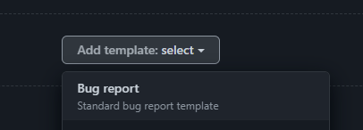

# Exercise 2 - Issue Templates and Forms (Optional)

To maintain consistency and ensure we collect all the information we need for issues, GitHub supports Issue Templates and the newer Issue Forms. Both of these simply act as a way to prompt users for the correct information when creating an issue.

First, let's create an Issue Template for a logging a bug. We can do this quickly with preconfigured templates.

1. In your repository, go to Settings, then scroll down to the Features section.
2. Next to Issues, click `Set up templates`
3. Add a Bug report template



4. Click `Propose changes`, then `Commit Changes` (directly to the main branch)
5. Go to Issues and create a new Issue. You should see your bug report template as an option. Click `Get started`.


6. Examine the template you're given. Note that it's all still Markdown, but it gives you a starting point.

That's great, but any user can just delete or modify that markdown. Issue Forms takes it one step further, giving the user a form to fill out.

Let's create a simple Issue Form for a Feature Request.

1. Navigate to the Code tab for your repository.
2. Click on the `.github/ISSUE_TEMPLATE/` folder in the file listing
3. Click `Add file` then `Create new file`
4. Name your file `feature-request.yml` and copy-paste the following into the main text area.

```yaml
name: Feature Request
description: Use this form to request a new feature
title: "Name of new feature"
labels: ["enhancement"]

body:
  - type: markdown
    attributes:
      value: |
        :tada: Thanks for Suggesting a new feature! :tada:
        
        Use this form to supply details about the feature you'd like to see.
  
  - id: description
    type: textarea
    attributes:
      label: Description
      description: "Describe the feature including where in the site it should live and what it should do"
    validations:
      required: true

  - id: owner
    type: input
    attributes:
      label: Owner 
      description: Who would own this feature
      placeholder: "@username"

  - id: typeoffeature
    type: dropdown
    attributes:
      label: Type of Feature
      description: "Is the feature entirely new, an enhancement, or a variation on an existing feature?"
      options:
        - New
        - Enhancement
        - Variation
    validations:
      required: true
      
  - id: affectedareas
    type: checkboxes
    attributes:
      label: Areas Affected
      description: "What areas of the application will this affect?"
      options:
        - label: Login/Authentication
        - label: Admin pages
        - label: Public-facing pages
        - label: Back-end and database
```

5. Commit the new file to the main branch
6. Once again, navigate to the Issues tab and create a new Issue
7. This time, choose your new Feature Request form.
8. Note the difference between this and the template
9. Use the form to create a new Issue, then look at the resulting issue body. Note that it's still just markdown!

_Hint: If you don't see the feature request option, there may be something wrong with your yaml file. Navigate to the file in the Code tab of your repository GitHub should tell you what's wrong!._