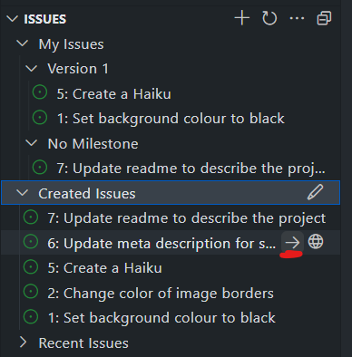
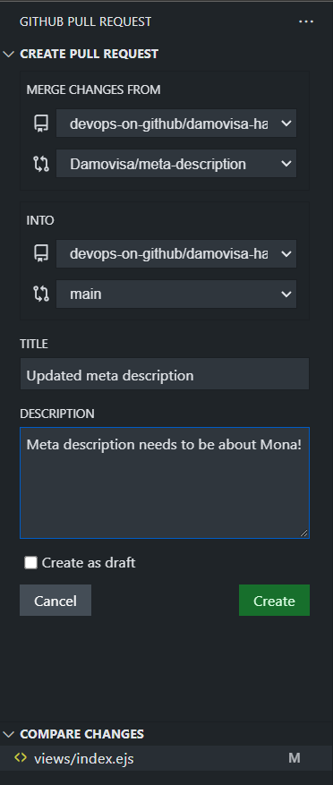
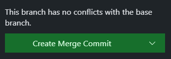

# Exercise 1 - Make a simple change

1. Navigate to the Code tab of your repository
2. Press the `.` key on your keyboard. Note the URL change as we go to github.dev.
3. Spend a few minutes familiarising yourself with VS Code running in the browser. In particular, make note of what you can and can't do!
4. Click on the Extensions icon on the Activity Bar (to the left) to bring up the extensions view. Note the extensions that have been installed.
5. Now click on the GitHub icon on the Activity Bar
6. In the Issues section on the lower half, expand `Created Issues` to see all the issues you've created.
7. Find the issue to update the meta description for the page
8. Hover over the issue and click the → button to starting working on that Issue. When prompted to name the new branch, choose a meaningful name.



When you click this button, Two things will happen:
 - A new branch will be created for your repository
 - The web editor will reopen, switched to the new branch

 9. In the Explorer, find `views/index.ejs` and click the file
 10. In the editor, make a change to the `content` attribute in line 8 so we have a better description. Save your changes.

 ```html
 <meta property="og:description" content="Some of the best haikus you'll ever read about our rescue dog June">
 ```

 11. Click on the Source Control icon in the Activity Bar.
 12. Click the `+` icon next to your changed file (this is equivalent to a `git add` command).
 13. Write a commit message, then click the ✓ icon at the top (this is equivalent to a `git commit` command). If you include the ID of the issue, prefixed by a `#` (e.g. `Fixes #5`), this commit will be automatically linked to that issue.


 _Note: If you're used to working locally, this feels like a commit and a push in one. It's important to remember with the web editor that we haven't cloned our code - we're working directly in the repository!_

 At this point, we've made a change, and we've committed it to our branch. The next thing we need to do is make a pull request.

 14. In the same Source Control window, click the pull request icon  to the left of the ✓.
 15. Add an appropriate title and description.

 _**Important:** Make sure you're committing from the branch you just created in your own repository to the main branch in that repository. While it's almost certainly going to be correct in this case, it's good practice to check. If you're working on a fork, the defaults may not be what you want!_

 

 16. Click on the file in the `Compare Changes` section to see a diff of the changes you made.

Before clicking the `Create` button, look at the status bar at the bottom of the VS Code window. You should see the branch you're on, and GitHub in blue.

 17. Ok, now click `Create`.
 
 Look at the status bar again, and see that you've been taken to review mode - there will be a Pull Request reference alongside the other pieces of information.

 18. Examine the view on the left, showing the details of the pull request. You can click on individual files to see the diff, and drill down into any commits that make up this pull request.

 _Note: This is a very simple example of a pull request you created yourself. However, this is the same view you will get if you use the web-based editor in the context of a pull request you're reviewing!_

 19. Leave a comment either in the pull request details in the main window, or in the view on the left.
 20. When you're ready, merge the change using either the `Merge Pull Request` button (then `Create Merge Commit`) in the main window, or the `Create Merge Commit` button on the left view.

 
 

 _There are different types of merge and they each have advantages and disadvantages. For this workshop we're just going to use the default._

 21. Click `Delete Branch...` then `Ok` in the prompt that appears at the top of the screen.

 _Note: You don't have to delete the branch if you don't want to! However, because we've merged the pull request into our main branch, we don't need it any more. It's good practice to remove branches when you don't need them, lest we end up with a pile of old code!`

 22. Finally, look at the status bar at the bottom of the window. You'll see that we're back in our main branch with our changes merged.
