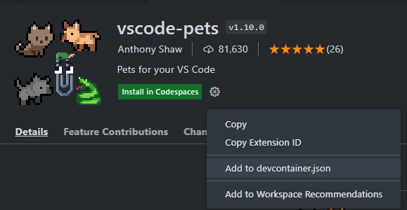

# Exercise 2 - Customising our Dev Container

The default Codespace has a lot of stuff configured. It's a great place to get started, but it's not optimized for any particular project. For example, it contains .NET SDKs, Python installations, and more.

In this exercise, we'll customize our development container to optimize it for Node development.

_If your Codespace has stopped due to timeout, you'll need to start it again. It should start back up exactly where you left it!_

## Let's customize!

1. In your Codespace window, press `Ctrl/Cmd-Shift-P` to open the Command Palette.
2. Search for "dev container" and select `Codespaces: Add Development Container Configuration Files...`

We'll want to use the Node.js container, but first, let's have a look at all the templated options available.

3. Select `Show All Definitions...` and scroll through the list.
4. When you've seen what's there, select `Node.js`. That's all we'll need for this application.

5. For the next prompt (node version), select `16-bullseye (default)`
6. The next prompt asks for additional tools to be installed. Think about which you might use for your project.

_Note: You can click the info icon on the right of any options if you want to learn more about what's installed._

7. Click `OK` without selecting any additional extensions
8. Look for the notification on the bottom right of the window telling you your devcontainer configuration has changed. Click `Rebuild Now` to rebuild your development environment, then `Rebuild` on the warning prompt.

The Command Palette (via the Codespaces extension) is a useful way to generate the files needed for customization. After rebuilding, we'll examine these files to see what's been created.

When the Codespace reloads, you'll see a message in the terminal letting you know you're using a custom image!

9. Navigate to the Explorer and open the `.devcontainer/devcontainer.json` file. It may already be open. Examine the file to see what is defined. In particular, note the reference to `Dockerfile`
10. Now open `Dockerfile` in the same `.devcontainer` folder. Examine this file and the comments.

_Note: There are a number of links in these files you can follow to learn more about these files._

11. Open the `devcontainer.json` file again and look at the `customizations.vscode.extensions` node in the JSON. If you know the unique identifier for an extension, you can add it directly, but there's a better way.
12. Click the `Extensions` icon in the Activity Bar
13. Search for "vscode pets" and click on the name (_Don't click Install!_)
14. Next to the `Install` button, click the ⚙️ icon and choose `Add to devcontainer.json`
15. Go back to the `devcontainer.json` file and examine the extensions node again. You'll see the `tonybaloney-vscode-pets` extension has been added to the container definition, even though it's not currently installed.

16. Press `Ctrl/Cmd-Shift-P` to open the Command Palette
17. Search for "rebuild" and select `Codespaces: Rebuild Container`. Once again wait for the Codespace to reload.

## Source control...

If you go to the Source Control view, you'll see that neither the `devcontainer.json` or `Dockerfile` have been committed and pushed to the repository.

What does this mean?

Well right now, we're just working with local files in your Codespace. Remember that this is a VM, so unlike the web-based editor there's a machine here and a local clone. Until you commit these files and push them to your repository, any changes you make will only affect this Codespace.

If you commit and push these files to the repository, any Codespace you create will use this devcontainer definition. This is how you can standardize on the environment used to contribute to your project, and how you can get new developers up to speed very quickly.

Right now, let's not commit these files. In the next exercise, we'll start again but commit the changes to the repository.

## Prebuilds

One final thing. You may have noticed that creating a Codespace can take a little time. While it's a lot faster than provisioning a new laptop, you may need to wait several minutes on larger repositories.

In this section, we'll enable prebuilds. This feature can dramatically speed up Codespace creation by keeping a template up to date with the latest code and any customizations to your container.

The performance improvements can be dramatic. On its `github/github` repository, GitHub went from 45min down to about 10 seconds. Not a typo!

18. Go back to your repository (you can do this quickly by clicking the blue `Codespaces` in the status bar and choosing `Go to repository`)
19. Navigate to Settings, then Codespaces.
20. Click `Set up Prebuild`
21. Select the `main` branch, and leave the rest as the defaults.
22. Click `Create`.

You may need to refresh the page, but you should see your Codespace prebuild running.

This will take some time, so let's leave it for the moment. We'll have a look at the result later.