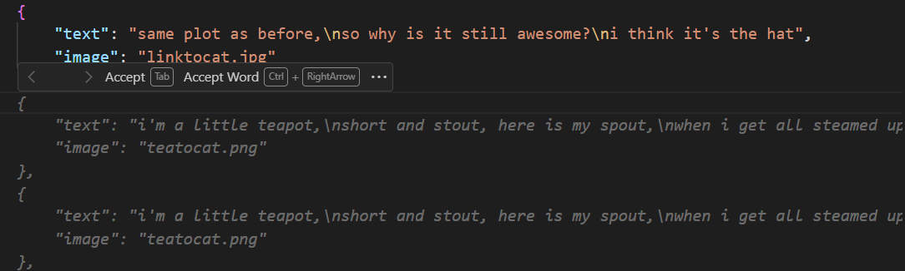
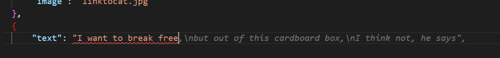

# Exercise 1 - Prompting Copilot

We're going to get Copilot to help us fix a couple of the issues we created earlier - randomizing the haiku list, and writing a new haiku.

_Note: You'll need to install the GitHub Copilot extension to get this to work! You can do this in the Extensions tab of VS Code._

1. Open the `index.js` file
2. Add a new line above line 11 (`res.render...`).
3. Write a comment:
```javascript
// randomize the haikus
```

4. GitHub Copilot should give you a suggestion for randomizing the haikus!

Now let's see if Copilot can help us write a new Haiku

5. Open the `haikus.json` file
6. After the last haiku (after the `}` character), add a comma (`,`) then press Enter to create a new line.
7. Copilot might take a little longer this time, but it should add some more JSON.
8. Keep the parts of the JSON you want, but make a change to the text, stopping before you finish writing a haiku. You can play with the results to see what you get!



For example:




You'll notice that Copilot works fairly well with both code and written text!

Feel free to explore some more! Some suggestions:
- Add a json comment (even though they're not allowed) to describe the haiku you want
- Add another property to a haiku object and see how Copilot can help you modify the rest of your code accordingly

## Resources:
- [GitHub Copilot](https://gh.io/copilot)
- [GitHub Copilot Prompt Engineering](https://dev.to/github/a-beginners-guide-to-prompt-engineering-with-github-copilot-3ibp)