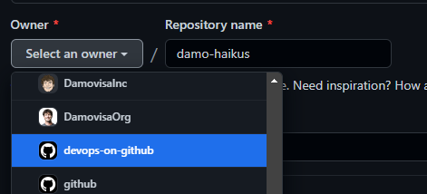

# End to End DevOps with GitHub

Welcome to the **End to End DevOps with GitHub** workshop!

This repository is your source for all the workshop materials. You'll find topics in folders and markdown files in each folder with each piece of learning material and exercise.

This repository also has [Discussions](https://github.com/devops-on-github/workshop/discussions) enabled for Q&A and conversation as we go.

# Getting Started:
Let's get started! In this workshop, we will use a template as a baseline.

1. Navigate to [this repo](https://github.com/github/haikus-for-codespaces) and click on `Use this template` as a baseline for your new repository. 

2. Select this workshop Org `devops-on-github` as the owner of your new repository.

3. Choose a name and a description for your new repository that it's easy to remember as your own.
There's no need to include every branch.

4. You're all set, follow the instructions during the workshop.

# Content: 
- [Intro to DevOps](1-Intro-to-DevOps/)
- [Planning and Tracking](2-Planning-and-Tracking/)
  - [Issues](2-Planning-and-Tracking/2.1-GitHub-Issues/)
  - [Projects](2-Planning-and-Tracking/2.2-Projects/)
- [The Inner Loop](3-The-Inner-Loop/)
  - [Web Editor](3-The-Inner-Loop/3.1-Web-Editor/)
  - [Codespaces](3-The-Inner-Loop/3.2-Codespaces/)
- [Automation](4-Automation/)
  - [Actions Basics](4-Automation/4.1-Actions-Basics/)
  - [Software Delivery and CI/CD with Actions](4-Automation/4.2-Software-Delivery-CICD/)
- Wrap up
